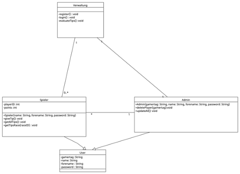
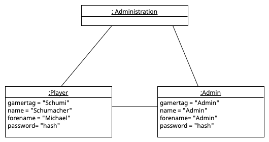
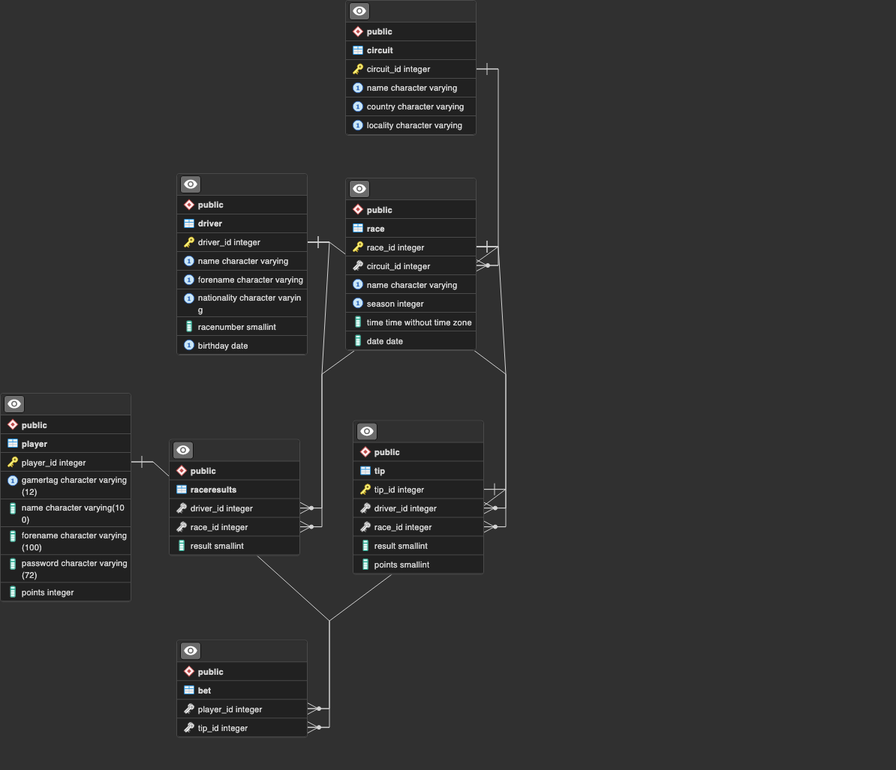

# Race Prediction Game

## Introduction

The aim of the project is to create a Formula 1 racing prediction game where players can register to make race result predictions. Based on the race results, players will receive points, and the goal for each player is to accumulate the most points to win the game.

## Project Scope

The requirements for the project include having a complete program logic to host a freely accessible web application. Players should be able to submit their predictions, log in, and register through a terminal. Including fully implemented admin functions, and the algorithm for player prediction submissions.

## Technologies used
* Object-oriented programming
* Implementation of Data Access Objects (DAO)
* Threading
* Password Hashing
* SQL
* Persistent data storage
* PostgreSQL
* Psycopg2
* Python
* Ergast API
* Fast API (not fully implemented)

## Prequesits to start the programm
* internet connection
* "DatabaseConnection.py" must be correctly configured with your database port
* PostgreSQL Database. configured with the "racingDatabase.sql"
* Python and an IDE

## UI

The programm is used via the terminal in the future i will deploy an Website with a GUI

## Diagramms and Models

### Use-Case-Diagramm
  
People using the RacePrediction Game application have the option to register and become a player of this application. A player can view their submitted tips for a race and also place bets on a driver. The available races and drivers for betting are displayed for the player to make their choice. The admin has the ability to delete players. Both the admin and players can log in to the Race Prediction Game, and individuals can register using their data.

### Classdiagramm
 
The Administration class has the functions register which allows people to register, the login() function allows players to log in and the evaluateTips function scores players' tips when race results are received. Admin and player inherit from the User class the attributes gamertag, name, forename ,password and the login function to log in. The player has the attributes playerID and Points, as well as the functions giveTip to submit a tip, getAllTips to view submitted tips and getTipsRace to get tip submissions from the player for a specific race.
The admin has the deletePlayer function to delete players and the updateAll function to get the latest race results. The players and the admin know one administration, the administration knows one admin and none to any number of players

### Objectdiagramm
  
The object diagram shows a typical situation: An admin - here "admin" - can manage several players (enumeration). The player Michael Schumacher has the password "hash" and the gamertag "Schumi". The admin has the gamertag, name and first name "admin" and the password "hash".

### Entity-relationship-model and Relational-model

__Player__ (<ins>Player_ID</ins>,Gamertag, Name, Vorname, Password, Points) 
__Tip__ ( <ins>Tip_ID</ins>,#Driver_ID,#race_ID, result, points)  
__Race__ (<ins>Race_ID</ins>, Season,#circuit_ID time, date)  
__Circuit__ (<ins>Circuit_ID</ins>, Country, Name, Locality)  
__bet__ (<ins>#player_Id,#tip_id</ins>)  
__Driver__ (<ins>Driver_ID</ins>, Name, Forename, Nationality, RaceNumber, Birthday) 
__Raceresult__ (<ins>#Driver,#Race_ID</ins>, result)

The object diagram shows a typical situation: An admin - here "admin" - can manage several players (enumeration). The player Michael Schumacher has the password "hash" and the gamertag "Schumi". The admin has the gamertag, name and first name "admin" and the password "hash".
Description ERM and RM
The ERM consists of the entity types Player, Tip, Race, Circuit, Driver as well as the association tables Bet and Raceresult which are necessary due to n:m cardinality.

Player has the attributes Gamertag, Forename, Name, Password and Points as well as the identifying attribute Player_ID. Player can bet on multiple tips, multiple players can bet on one tip, so an n-m relationship is necessary here.
Tip has the attributes Result and Points and the identifying attribute Tip_ID.

Tip has a 1..1 cardinality to Driver and vice versa a 0..n. Driver has the attributes Name, Forename, Nationality, RaceNumber, Birthday and the identifying attribute Driver_ID. Driver has a 0..n cardinality to Race and Race has a 0..m cardinality to Driver.
The relationship type Raceresult has the attribute Result.

Race has the attributes Season, Time, Date and the identifying attribute Race_ID.
Race has a 1..1 cardinality to Circuit and Circuit has a 0..n. cardinality.
Circuit has the attributes Name, Country and Locality as well as the identifying attribute Circuit_ID.

Complementary to the attributes in the ERM, the identifying attributes and foreign keys are as follows:

- Tip has the foreign keys Driver_ID and Race_ID.
- Race has the foreign key Circuit_ID.
- Bet has the foreign keys Player_ID and Tip_ID.
- Raceresult has the foreign keys Driver_ID and Race_ID.

These foreign keys allow links between the tables and are used to establish relationships between the data.
